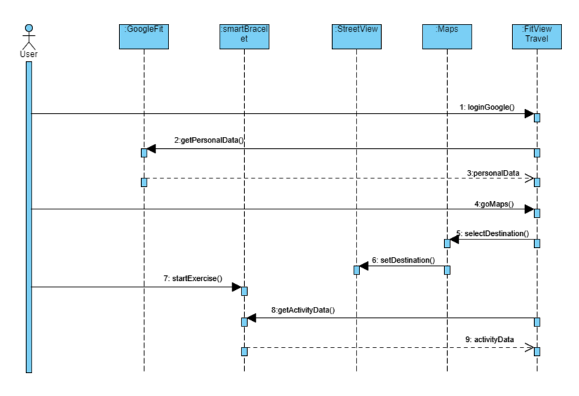

# FitView-Travel
## What is FitView Travel?
"FitView Travel" is a web application that allows users to track their health data and also experience a virtual travel around the world using StreetView API. Using this application created with Vue.js, you will be able to receive health data from Google Fit and view this data on an activity profile. The app provides navigation on StreetView via Google Maps and StreetView APIs. Users can take a virtual walk anywhere in the world using the app. The app also provides a real-time fitness experience with real-time data taken from the smart wristband.

## Technologies Used

1.	Vite + Vue.js (Vue3) | Front-end Framework

2.	Bootstrap | Front-end Library

3.	JavaScript | Software Language

4.	Node.js | Running Environment

5.	Google Oauth 2.0 | Google Authentication

6.	Google Maps API | Maps Access

7.	Google StreetView API | StreetView Access

8.	Google Fitness API | Fitness Data Access

9.	miband-heartrate app by Eryux : https://github.com/Eryux/miband-heartrate | Real Time Heart Rate Data Access

## How It Works ?

## Project Members | Scope

Ali Ufuk Baktır (Project Leader): Project Setup, API Integration, Google Auth, Fitness API, Real Time Heart Rate Data, Recent Activity Profile Page

Rami Alzytawi: Maps API and MiniMap Integration

Ayça Yıldız: StreetView Bike Interface Design

Melisa Karadağ: Real-Time Data Functions, Maps API

Sude Önder: Real-Time Data Functions, Maps API

## How To Use ?
Use these commands to install modules and run:

npm install

npm run dev

! Keep in mind that you will need an API Key from Google Cloud Platform. After you setup a project in Google Cloud Console, you can create ".env" file that will encapsulate the API Key. !

## To do List
•	Specific navigable route options need to be added.

•	Real-time fitness data will be captured instantly via application APIs that synchronize with the smart bracelet instead of a third-party application.

•	Progress will be made on StreetView by taking real-time step data.

•	Activity done in the app should be saved into Google Fit.

•	New data to be received in real time should be added.

